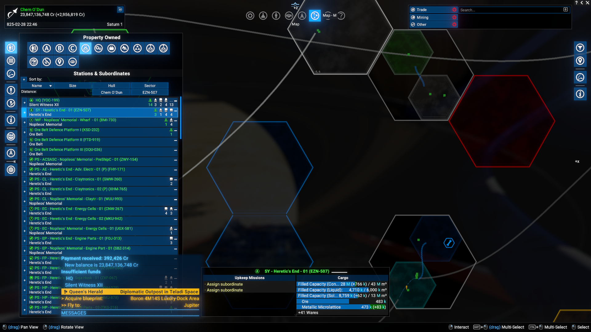
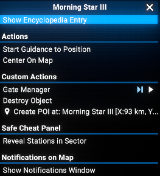
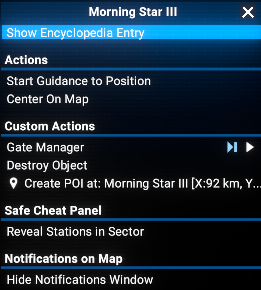
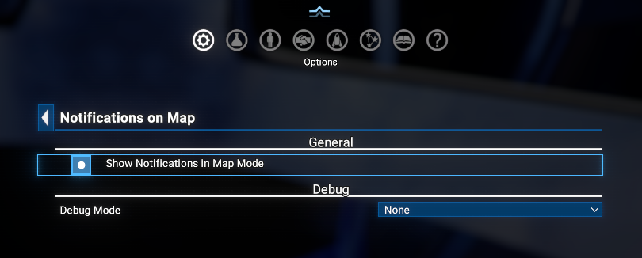

# Notifications on Map

Makes the **Notification window** available while the **Map is open**. Normally, game notifications are suppressed when the Map is displayed - this mod restores them, so you never miss an alert while managing your empire.

## Features

- **Notifications in map mode**: The notification window is shown while the map is open, just as it would be in normal flight view.
- **It still made by Egosoft**: The mod does not create a new notification system, it simply "reveals" the existing one in map mode, by forcing it to be shown and adjusting its position to minimize interference with the map UI.
- **Notifications still suppressed in other modes**: Notifications are only shown in map mode - they remain hidden in other modes (e.g. station view).
- **Configurable**: The feature can be toggled on or off as via **Options Menu > Extension options > Notifications on Map** as via **Context Menu**.
- **Compatible with X4 8.00 and 9.00**, but currently published for 9.00 only.
- **Can work with SWI** - please use with the [kuertee UI Extensions and HUD for SW Interworlds adoption mod](https://www.nexusmods.com/x4foundations/mods/2134).

## Requirements

- Please use only **latest version** of the **UI Extensions and HUD** for appropriate game version!
- **X4: Foundations**: Version **8.00** and **UI Extensions and HUD**: Version **v8.0.4.5** or higher (in v8.x branch) by [kuertee](https://next.nexusmods.com/profile/kuertee?gameId=2659).
- **X4: Foundations**: Version **9.00** or higher and **UI Extensions and HUD**: Version **v9.0.0.5** or higher (in v9.x branch) by [kuertee](https://next.nexusmods.com/profile/kuertee?gameId=2659).
- **Mod Support APIs**: Version 1.95 or higher by [SirNukes](https://next.nexusmods.com/profile/sirnukes?gameId=2659):
  - Available on Steam: [SirNukes Mod Support APIs](https://steamcommunity.com/sharedfiles/filedetails/?id=2042901274)
  - Available on Nexus Mods: [Mod Support APIs](https://www.nexusmods.com/x4foundations/mods/503)
- **Options Helper** version 1.0 or higher by [Chem O\`Dun](https://next.nexusmods.com/profile/ChemODun/mods?gameId=2659):
  - [Steam Workshop](https://steamcommunity.com/sharedfiles/filedetails/?id=3715253556)
  - [Nexus Mods](https://www.nexusmods.com/x4foundations/mods/2089)

## Installation

- **Steam Workshop**: [Notifications on Map](https://steamcommunity.com/sharedfiles/filedetails/?id=3722049740) - currently only for 8.00, due to limitations of Steam Workshop for X4 mods.
- **Nexus Mods**: [Notifications on Map](https://www.nexusmods.com/x4foundations/mods/2103) - there are separate versions for 8.00 (8.00.xx) and 9.00 (9.00.xx), so make sure to download the correct one for your game version.

## Usage

The notification window will not appear in map mode until you enable it from the extension options. Open **Options Menu > Extension options > Notifications on Map** and toggle **Show Notifications in Map Mode** to your preference. The change takes effect immediately - no need to restart the game.

### Context Menu

Simple press righ button in the map mode on free space in any sector and you will see the context menu with options to show or hide notifications in map mode.

## Extension Options

Open **Options Menu > Extension options > Notifications on Map** to configure the mod.

### General

- **Show Notifications in Map Mode**: Enable or disable the notification window while the map is open. Default: off.
- **Switch via Context Menu**: Enable or disable the context menu options to show/hide notifications in map mode. Default: off.

### Debug

- **Debug Mode**: Sets the logging verbosity. Options: **None** (default), **Debug**, **Trace**. Useful for troubleshooting only - leave at None during normal play.

## Videos

[Video demonstration of the Notifications on Map](https://www.youtube.com/watch?v=dl29qbqg4LQ)
[Video demonstration of the switching via Context Menu](https://www.youtube.com/watch?v=5Kj8zFEGel4)

## Credits

- **Author**: Chem O`Dun, on [Nexus Mods](https://next.nexusmods.com/profile/ChemODun/mods?gameId=2659) and [Steam Workshop](https://steamcommunity.com/id/chemodun/myworkshopfiles/?appid=392160)
- *"X4: Foundations"* is a trademark of [Egosoft](https://www.egosoft.com).

## Acknowledgements

- [EGOSOFT](https://www.egosoft.com) - for the X series.
- [kuertee](https://next.nexusmods.com/profile/kuertee?gameId=2659) - for the `UI Extensions and HUD` that makes this extension possible.
- [SirNukes](https://next.nexusmods.com/profile/sirnukes?gameId=2659) - for the `Mod Support APIs` that power the UI hooks and options menu.

## Changelog

### [9.00.05] - 2026-06-04

- **Changed**
  - On Steam: restricted to game version 9.0 or higher

### [8.00.04]/[9.00.04] - 2026-06-04

- **Fixed**
  - Version 8.x.x distributive on steam

### [8.00.03]/[9.00.03] - 2026-06-04

- **Added**
  - Context menu switching between showing and hiding notifications in map mode.

### [8.00.02]/[9.00.02] - 2026-05-10

- **Fixed**
  - Extra windows were displayed when switched from flight mode.

### [8.00.01]/[9.00.01] - 2026-05-10

- **Added**
  - Initial public version.
